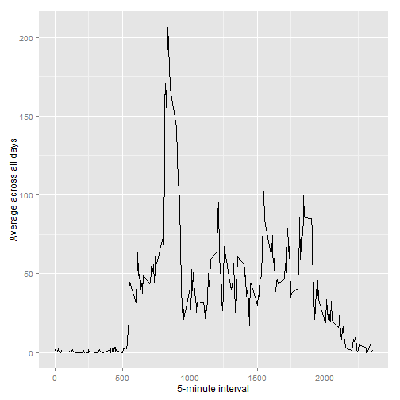
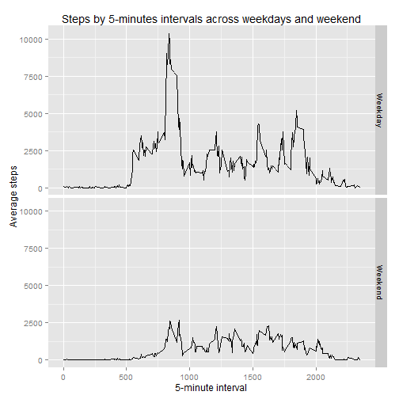

Reproducible Research: Peer Assessment 1
========================================================

## Introduction

It is now possible to collect a large amount of data about personal movement using activity monitoring devices such as a Fitbit, Nike Fuelband, or Jawbone Up. These type of devices are part of the "quantified self" movement - a group of enthusiasts who take measurements about themselves regularly to improve their health, to find patterns in their behavior, or because they are tech geeks. But these data remain under-utilized both because the raw data are hard to obtain and there is a lack of statistical methods and software for processing and interpreting the data.

This analysis makes use of data from a personal activity monitoring device. This device collects data at 5 minute intervals through out the day. The data consists of two months of data from an anonymous individual collected during the months of October and November, 2012 and include the number of steps taken in 5 minute intervals each day.

## Data

The data for this assignment can be downloaded from the course web site:  

- Dataset: Activity monitoring data [52K]

The variables included in this dataset are:

- steps: Number of steps taking in a 5-minute interval (missing values are coded as NA)  


- date: The date on which the measurement was taken in YYYY-MM-DD format  


- interval: Identifier for the 5-minute interval in which measurement was taken  


The dataset is stored in a comma-separated-value (CSV) file and there are a total of 17,568 observations in this dataset.

## Analysis

### Loading data


```r
data <- read.csv( "activity.csv")
```

### What is mean total number of steps taken per day?

The following graphs shows a histogram of the total number of steps taken each day, the missing values (NA) in the dataset, were ignored. 


```r
library(ggplot2)

t <- aggregate(steps ~ date, data = data, FUN = sum  )
qplot(steps,data = t)
```

 


```r
Mean <- round(mean(t$steps))
Median <- round(median(t$steps))
```

The mean and the median of the steps are 10,766 and 10,765, respectively. 


### What is the average daily activity pattern?

The following graphs shows the 5-minute interval and the average number of steps taken, averaged across all days.


```r
t2 <- aggregate(steps ~ interval, data = data, FUN = mean  )

g <- ggplot(t2, aes(x=interval, y = steps))
g + geom_line() + 
        labs(y = "Average across all days") +
        labs(x = "5-minute interval")
```

 


```r
Max <- t2[t2$steps == max(t2$steps), "interval" ]
```
The 5-minute interval with the maximum number of steps was the interval number 835. 

### Imputing missing values


```r
naQ <- nrow(data[is.na(data),])
```

The data has 2304 of missing values (coded as NA) in the steps variable. The presence of missing days may introduce bias into some calculations or summaries of the data. For that instance, the missing values were fillied using the mean of the correspondent interval, analized the missing value effect. 


```r
data2 <- merge(data, t2, by = "interval")

data2$steps <- mapply(function(x,y){
        if(is.na(x)) {
                y
        } else {
                x
        }
}, data2$steps.x, data2$steps.y)
```

The following histogram shows the total number of steps taken each day using the data without missing values. 


```r
t3 <- aggregate(steps ~ date, data = data2, FUN = sum  )
qplot(steps, data = t3)
```

 

```r
Mean <- round(mean(t3$steps)) 
Median <- round(median(t3$steps))
```

The mean and the median of the steps, for the data without missing values, are 10,766 and 10,766, respectively. Comparing this results with the priors shows that the NA does not affect the analysis. 

### Are there differences in activity patterns between weekdays and weekends?

As part of the analysis, the effect of the weekdays was evaluated. 

```r
data2$day <- weekdays(as.POSIXlt(data2$date), abbreviate = FALSE)
data2$day2 <- ifelse(data2$day %in% c("Saturday","Sunday"), "Weekend", "Weekday") 
```

The following graphs sows the relation of the steps and the intervals during the day by weekday and weekend. 


```r
t4 <- aggregate(steps ~ interval + day2, data = data2, FUN = sum  )
 g <- ggplot(t4, aes(x=interval, y = steps))
g + geom_line() + facet_grid(day2 ~.)+
        labs(y = "Average steps") +
        labs(x = "5-minute interval") + 
        labs(title = "Steps by 5-minutes intervals across weekdays and weekend")
```

 

From the graphs we can interpret that for this individual the weekday are more active that the weekends. 


